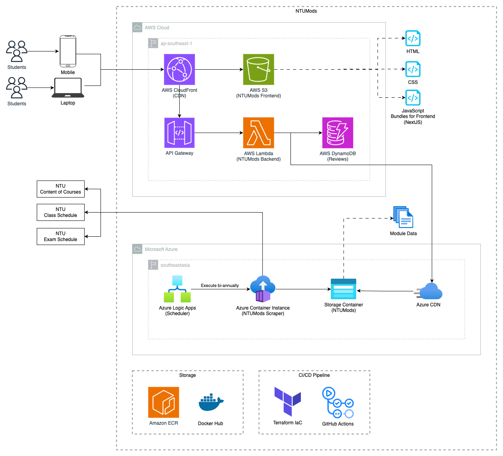

# NTUMods

## Architecture
The NTUMods system leverages a combination of cloud services from Amazon Web Services (AWS) and Microsoft Azure to host and manage the application's frontend and backend components, along with DevOps tools that aid in infrastructure management and continuous integration and delivery.

### Amazon Web Services

1. **Elastic Container Registry (ECR):**  
   A fully managed Docker container registry to store and manage the application's container images securely. The backend images hosted in ECR are used with AWS Lambda for deployment and execution of the serverless backend functions.

2. **AWS CloudFront:**  
   CloudFront serves as the content delivery network (CDN) to distribute the frontend assets with low latency and high transfer speeds. It ensures that students using the NTUMods system experience quick load times for the web application, regardless of their geographical location.

3. **AWS S3:**  
   Amazon Simple Storage Service (S3) is used to store and serve static web resources for the NTUMods frontend, including HTML, CSS, and JavaScript files bundled using Next.js, a React framework.

4. **AWS API Gateway:**  
   This service acts as the entry point for the backend, managing and directing incoming HTTP requests to the appropriate Lambda functions. It enables a secure connection between the client side and the serverless backend.

5. **AWS DynamoDB:**  
   DynamoDB is a NoSQL database service that stores and retrieves the data needed by the application. It offers fast and predictable performance with seamless scalability.

### Microsoft Azure

1. **Azure Logic Apps:**  
   A cloud service that helps you schedule, automate, and create workflows to integrate services. This service is used to orchestrate and automate the processes associated with retrieving and updating the module data from NTU resources.

2. **Azure Container Instance:**  
   A container-on-demand service that allows users to run containers directly. The container instance runs the NTUMods Scraper script, responsible for extracting NTU's course content, class schedules, and exam schedules. This service executes biannually to keep the module information up-to-date.

3. **Azure Storage Container:**  
   Module data extracted by the NTUMods Scraper is stored in Azure Storage Containers, providing a secure and scalable solution for housing the data before distribution.

4. **Azure CDN:**  
   Integrated with Azure Storage, Azure CDN caches the module data close to users, reducing latency and load times, thereby accelerating content delivery and enhancing the user experience.

### DevOps and Tooling

1. **Terraform Infrastructure-as-Code (IaC):**  
   The NTUMods system's cloud infrastructure is defined and provisioned using Terraform, enabling consistent and automated deployments across AWS and Azure platforms.

2. **Docker Hub:**  
   Docker Hub serves as the central image repository for the NTUMods Scraper's Docker images. These images are then pulled by Azure Container Instances for version control and container deployment management.
